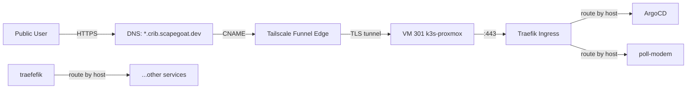

# Implementation: Tailscale Funnel + DNS for *.crib.scapegoat.dev

## Goal

Expose k3s services running on the Proxmox VM publicly via `*.crib.scapegoat.dev` using Tailscale Funnel, without opening any ports on the cable modem.

## Architecture



## Prerequisites

- VM 301 running k3s + ArgoCD on Tailscale (`k3s-proxmox`, `100.67.90.12`)
- Tailscale Funnel enabled on the VM
- DNS managed via Terraform + DigitalOcean (`~/code/wesen/terraform/dns/zones/scapegoat-dev/envs/prod/`)
- Traefik re-enabled in k3s

## Step 1: Re-enable Traefik in k3s

Currently disabled in the cloud-init. Need to remove `traefik` from the disable list.

```yaml
# /etc/rancher/k3s/config.yaml
write-kubeconfig-mode: "0644"
# Remove this section:
# disable:
#   - traefik
tls-san:
  - k3s-server
  - k3s-server.tail879302.ts.net
  - k3s-proxmox
  - k3s-proxmox.tail879302.ts.net
```

Then `systemctl restart k3s`.

## Step 2: Enable Tailscale Funnel

```bash
# On VM 301
sudo tailscale funnel 443 on
# Or for more control:
sudo tailscale serve https / http://127.0.0.1:443
```

Verify: `curl https://k3s-proxmox.tail879302.ts.net` should reach Traefik.

## Step 3: Add DNS Record in Terraform

Add a CNAME record for `*.crib.scapegoat.dev` pointing to the Tailscale Funnel hostname.

File: `~/code/wesen/terraform/dns/zones/scapegoat-dev/envs/prod/main.tf`

```hcl
wildcard_crib_cname = {
  type  = "CNAME"
  name  = "*.crib"
  value = "k3s-proxmox.tail879302.ts.net."
  ttl   = 3600
}
```

Then:
```bash
cd ~/code/wesen/terraform
terraform -chdir=dns/zones/scapegoat-dev/envs/prod plan
terraform -chdir=dns/zones/scapegoat-dev/envs/prod apply
```

## Step 4: Create Traefik IngressRoute for services

Example for ArgoCD:

```yaml
apiVersion: traefik.io/v1alpha1
kind: IngressRoute
metadata:
  name: argocd
  namespace: argocd
spec:
  entryPoints:
    - websecure
  routes:
    - match: Host(`argocd.crib.scapegoat.dev`)
      kind: Rule
      services:
        - name: argocd-server
          port: 443
  tls: {}
```

Example for poll-modem:

```yaml
apiVersion: networking.k8s.io/v1
kind: Ingress
metadata:
  name: poll-modem
  namespace: poll-modem
  annotations:
    traefik.ingress.kubernetes.io/router.entrypoints: websecure
spec:
  rules:
    - host: modem.crib.scapegoat.dev
      http:
        paths:
          - path: /
            pathType: Prefix
            backend:
              service:
                name: poll-modem
                port:
                  number: 8080
```

## Step 5: TLS Certificates

Options:
1. **Tailscale Funnel TLS** — Funnel terminates TLS at the edge, forwards to Traefik. Traefik can use its own self-signed cert internally.
2. **Let's Encrypt via cert-manager** — Use cert-manager with DNS01 challenge (DigitalOcean API token) to get real certs.
3. **Tailscale certificates** — `tailscale cert crib.scapegoat.dev` provides certs for Tailscale-managed domains.

Recommend: Start with option 1 (Funnel terminates TLS), add Let's Encrypt later for non-Funnel routes.

## Files to modify

| File | Change |
|------|--------|
| `cloud-init.yaml` | Remove `disable: [traefik]` from k3s config |
| `~/code/wesen/terraform/dns/zones/scapegoat-dev/envs/prod/main.tf` | Add `*.crib` CNAME |
| `../poll-modem/kubeconfig.yaml` | Already working |
| New: `gitops/applications/poll-modem.yaml` | ArgoCD Application manifest |
| New: `gitops/kustomize/poll-modem/` | K8s manifests (Deployment, Service, Ingress, Secret) |

## Verification

```bash
# After setup, verify end-to-end:
curl -I https://argocd.crib.scapegoat.dev
curl -I https://modem.crib.scapegoat.dev
dig *.crib.scapegoat.dev  # Should resolve to Tailscale Funnel
```
