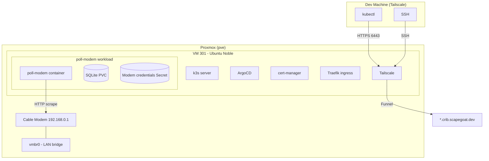

# PROJ - poll-modem k3s Cluster on Proxmox

A cable modem monitoring TUI application that was extracted from a monorepo, packaged as a standalone Go project, and deployed to a k3s Kubernetes cluster running on a Proxmox home server. The cluster uses ArgoCD for GitOps and Tailscale for secure remote access.

> [!summary]
> The project has three important identities:
> 1. **poll-modem** — a Go TUI that polls a cable modem's web interface and displays downstream/upstream channel quality, SNR, power levels, and error codewords in real time
> 2. **k3s-on-Proxmox infrastructure** — a fully automated cloud-init bootstrap that creates a production-grade single-node Kubernetes cluster with ArgoCD on a Proxmox VM
> 3. **homelab platform** — the cluster is intended to become a general-purpose deployment target for home infrastructure services, accessible via Tailscale and exposed publicly through `*.crib.scapegoat.dev`

## Why this project exists

The cable modem (Technicolor CGM4331COM on Cox) was showing intermittent connectivity issues. Some downstream channels had massive uncorrectable error rates (channels 27 and 37 showed millions of errors) while others were clean. The existing modem web UI doesn't persist data or show trends, so poll-modem was built to continuously collect and store channel statistics in SQLite for historical analysis.

The deployment story evolved from "run it in tmux on my laptop" through several stages — LXC container, then VM, then Kubernetes — because the real goal was to build a reusable homelab platform, not just run one binary.

## Current project status

The cluster is running and validated. Cloud-init template is tested and reproducible. The next phase is enabling Traefik ingress, Tailscale Funnel for public access, DNS via Terraform, and deploying poll-modem as the first ArgoCD-managed application.

### What works

- poll-modem extracted as standalone repo with build, lint, and GoReleaser
- poll-modem tested against real cable modem with 1Password-stored credentials
- k3s v1.34.6 + cert-manager + ArgoCD running on Proxmox VM 301
- Cloud-init template validated (full bootstrap from scratch in ~3 minutes)
- Tailscale join for direct kubectl and SSH access from any tailnet device
- Kubeconfig configured for `k3s-proxmox` via Tailscale MagicDNS

### What's next

- Re-enable Traefik ingress controller
- Configure Tailscale Funnel for `*.crib.scapegoat.dev`
- Add DNS record in Terraform (`*.crib → k3s-proxmox.tail879302.ts.net`)
- Build poll-modem container image (CGO + go-sqlite3)
- Push to GHCR via GoReleaser
- Create ArgoCD Application manifest for poll-modem
- Deploy poll-modem as the first GitOps-managed workload

## Project shape

```
poll-modem/
├── cmd/
│   ├── poll-modem/main.go       # CLI entry point
│   └── root.go                  # Cobra commands
├── internal/
│   ├── modem/
│   │   ├── client.go            # HTTP client + HTML parser
│   │   ├── database.go          # SQLite persistence
│   │   └── types.go             # Data structures
│   └── tui/
│       └── app.go               # Bubbletea TUI
├── cloud-init.yaml              # Full k3s+ArgoCD bootstrap template
├── scripts/
│   ├── create-k3s-vm.sh         # One-command VM creation
│   ├── setup-access.sh          # Tailscale join + kubeconfig
│   └── bootstrap-k3s.sh         # k3s + cert-manager + ArgoCD install
├── kubeconfig.yaml              # kubectl access via Tailscale
├── .goreleaser.yaml             # Release automation (deb, rpm, tar.gz)
├── Makefile                     # Build, lint, release targets
└── ttmp/                        # Deployment ticket + diary
```

## Architecture



## Implementation details

### The cable modem parser

The modem's web interface at `http://192.168.0.1` serves HTML tables with downstream/upstream channel data. The parser (`internal/modem/client.go`) uses goquery to extract:

- **Downstream**: Channel ID, lock status, frequency, SNR, power level, modulation (QAM256, etc.)
- **Upstream**: Channel ID, lock status, frequency, symbol rate, power level, channel type (ATDMA/TDMA)
- **Error codewords**: Per-channel unerrored, correctable, and uncorrectable codeword counts

Authentication uses a cookie-based session. The client handles session expiry and re-authentication automatically. Credentials are stored in 1Password under "coxwifi" and loaded at runtime.

### The Proxmox network problem

The cable modem at `192.168.0.1` does not respond to traffic from virtual MAC addresses on vmbr0. Containers and VMs on the bridged network can reach the Proxmox host (`192.168.0.227`) but not the gateway. This is likely MAC filtering or ARP table limits on the cable modem.

Solutions that worked:
- **VMs on vmbr0**: Get DHCP from the cable modem, have a real virtual NIC that the modem accepts
- **LXC on vmbr1**: NAT through the Proxmox host (`192.168.1.0/24` MASQUERADE to vmbr0), reach internet but not the modem directly
- **Tailscale**: Bypasses the cable modem entirely, gives direct access to VMs from any tailnet device

### Cloud-init for Proxmox VMs

Proxmox supports `--cicustom user=local:snippets/<file>.yaml` to provide custom cloud-init user-data. This overrides the built-in Proxmox cloud-init SSH key injection, so `ssh_authorized_keys:` must be included explicitly in the YAML.

The cloud-init does:
1. Package update/upgrade
2. Install ca-certificates, curl, git, jq, qemu-guest-agent
3. Install Tailscale from the official Ubuntu Noble apt repo
4. Write k3s config with TLS SANs for all Tailscale hostnames
5. Install k3s (without Traefik — will be re-enabled later)
6. Install cert-manager v1.13.0
7. Install ArgoCD (server-side apply to handle large CRDs)
8. Write `/etc/motd` with cluster summary and ArgoCD password

Tailscale join is intentionally left manual — auth keys should not be in cloud-init user-data.

### DNS and public access

DNS for `scapegoat.dev` is managed via Terraform + DigitalOcean at `~/code/wesen/terraform/dns/zones/scapegoat-dev/envs/prod/`. The plan is to add `*.crib.scapegoat.dev` pointing to the Tailscale Funnel endpoint, which exposes the k3s Traefik ingress publicly without opening cable modem ports.

## Important project docs

- `/home/manuel/code/wesen/2026-03-27--hetzner-k3s/` — reference k3s+ArgoCD setup (Hetzner, public IP, cloud-init)
- `/home/manuel/code/wesen/terraform/dns/zones/scapegoat-dev/envs/prod/main.tf` — DNS Terraform
- `ttmp/2026/04/15/poll-modem-lxc-deploy--deploy-poll-modem-as-lxc-container-on-proxmox/reference/01-diary.md` — full deployment diary
- `ttmp/2026/04/15/poll-modem-lxc-deploy--deploy-poll-modem-as-lxc-container-on-proxmox/reference/02-assessment.md` — session assessment

## Open questions

- Should poll-modem run as a TUI (needs tty) or headless data collector in k8s?
- What's the right image strategy — GoReleaser → GHCR, or local Docker build + import?
- How many services will run on this cluster? Is single-node sufficient long-term?

## Near-term next steps

1. Re-enable Traefik in k3s config
2. Enable Tailscale Funnel on VM 301
3. Add `*.crib` DNS record in Terraform
4. Write poll-modem Dockerfile (CGO_ENABLED=1 for go-sqlite3)
5. Create ArgoCD Application manifest for poll-modem
6. Apply and verify end-to-end GitOps deployment

## Project working rule

This project follows the hetzner-k3s pattern: Terraform creates infrastructure, cloud-init bootstraps the cluster, ArgoCD reconciles workloads. The Proxmox variant replaces Terraform with `qm create` + cloud-init snippets, and replaces public IP access with Tailscale Funnel.
